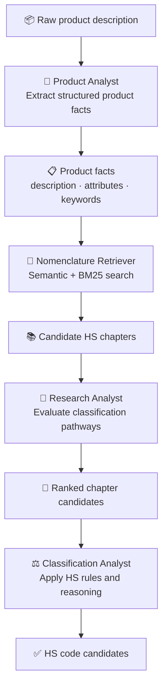

# Architecture

## Overview

Nomenclator is designed as a hybrid retrieval and reasoning system for
Harmonized System (HS) classification.

The architecture separates deterministic information retrieval from LLM-based
analysis. The retrieval layer identifies relevant areas of the HS nomenclature,
while DSPy-powered analysts perform structured reasoning over the retrieved
context.

This separation allows retrieval quality and classification reasoning quality
to be evaluated independently.

## Pipeline

## Components

### Product Analyst

The Product Analyst transforms an unstructured product description into
structured product facts.

Its responsibilities:

- Normalize the product description.
- Extract classification-relevant attributes.
- Identify useful retrieval keywords.
- Preserve user-provided HS code hints as unverified signals.

The Product Analyst does **not** perform classification.

Output:

- Normalized description.
- Product attributes.
- Retrieval keywords.

---

### Nomenclature Retriever

The Nomenclature Retriever provides deterministic candidate generation over the
HS nomenclature.

It combines two complementary retrieval strategies:

- **Semantic retrieval** using sentence embeddings to identify conceptually
  similar HS chapters.
- **BM25 lexical retrieval** to preserve exact terminology matches.

The two rankings are combined using **Reciprocal Rank Fusion (RRF)**, providing
robust retrieval across both conceptual and terminology-driven queries.

Output:

- Ranked candidate HS chapters.

The retrieval layer is independent from LLM reasoning, allowing retrieval
performance to be measured separately from classification performance.

---

### Research Analyst

The Research Analyst evaluates retrieved HS chapters and identifies plausible
classification pathways.

Its responsibilities:

- Review retrieved chapters.
- Compare competing classification areas.
- Rank the most relevant chapters.
- Explain why each chapter is relevant.

The Research Analyst does **not** assign final HS codes.

Output:

- Ranked chapter candidates.

---

### Classification Analyst

The Classification Analyst performs the final classification reasoning.

Its responsibilities:

- Analyze product facts.
- Review relevant HS chapter context.
- Apply HS classification principles.
- Consider competing classifications.
- Produce ranked HS code candidates with reasoning.

Output:

- Candidate HS codes.
- Classification reasoning.
- Confidence scores.

---

## Design Principles

### Separation of Retrieval and Reasoning

Retrieval and reasoning are intentionally decoupled:

- Retrieval identifies where to look.
- Analysts determine why a classification is appropriate.

This allows each layer to evolve independently.

### Deterministic Retrieval

The retrieval layer does not depend on LLM output.

Given the same nomenclature data, embedding model, and query, retrieval produces
consistent candidate chapters.

### Structured Agent Outputs

All LLM stages use typed outputs to ensure that intermediate results remain
machine-readable and can be passed reliably between pipeline stages.

### Progressive Narrowing

The system follows a narrowing strategy:

1. Raw product description.
2. Structured product facts.
3. Candidate HS chapters.
4. Relevant classification context.
5. HS code candidates.

This reduces the amount of nomenclature context required by the reasoning model
while keeping the classification process grounded in HS data.
